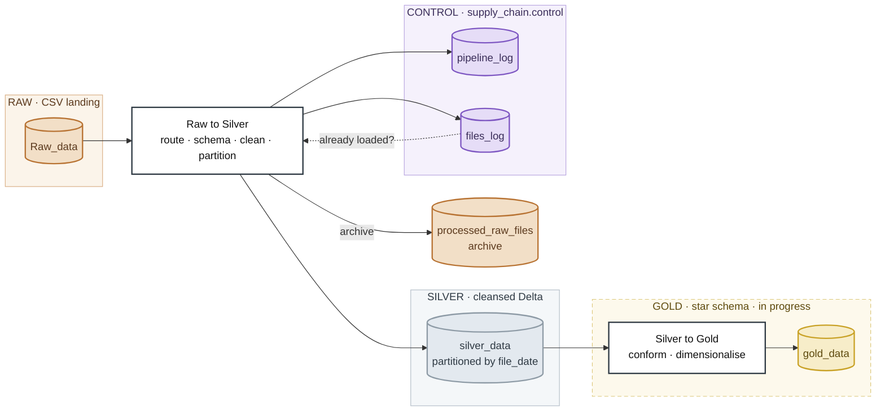
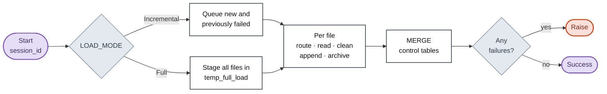
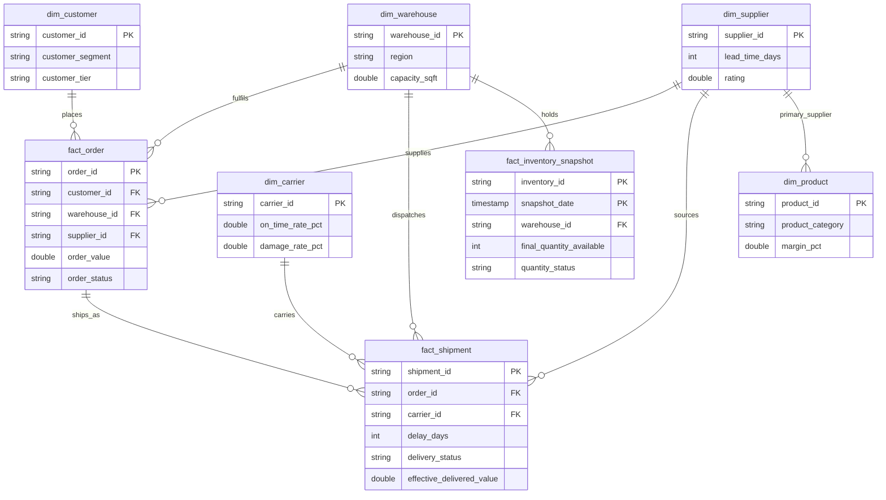

# Supply Chain Data Pipeline


A medallion pipeline on Databricks that lands supply chain CSV exports into partitioned Delta tables, cleans them per entity, and records every run in Delta control tables so a load can be audited rather than guessed at.

## Overview

Files arrive as `<table>_YYYYMMDD.csv` in a Unity Catalog volume. Each file is routed to a table by its name, read under an explicit schema, cleaned, and appended to Delta partitioned by the date in the filename. A star-schema gold layer is designed and in progress.

| | |
|---|---|
| Platform | Databricks — `dbutils`, pre-provisioned `spark` |
| Storage | Unity Catalog Volumes under `/Volumes/workspace/default/supplychain/` |
| Layers | Raw CSV → Silver Delta → Gold star schema |
| Grain | One CSV per table per day, partitioned by `file_date` |
| Load modes | Incremental, Full |
| Run tracking | `supply_chain.control.pipeline_log`, `.files_log` |

## Architecture



The control tables are not just a log: the raw→silver job reads `files_log` to decide what still needs loading, which is what makes Incremental mode restartable. There is no `bronze` directory — the raw CSV volume plays that role, with silver as the first Delta layer.

## How a run works



Three decisions in that flow are deliberate:

- **Explicit schemas, not `inferSchema`.** The read schema is pinned per table so a column cannot be re-typed by whatever one day's file happens to contain. Under Spark's default PERMISSIVE mode a value that does not match its declared type is read as null rather than raising.
- **Archive by copy, verify, delete.** A half-finished move cannot lose the source file.
- **Log before raising.** The `pipeline_log` summary is written first, so a failed run is still recorded, and only then does the job fail.

## Load modes

| Mode | Selects | Cleanup |
|---|---|---|
| Incremental | New and previously failed CSVs, by consulting `files_log` | Successes archived to `processed_raw_files/` |
| Full | Every CSV from both `Raw_data/` and the archive, staged in `temp_full_load/` | Staging deleted on success, preserved on failure for inspection |

## Data model

The designed gold layer is a star schema in `GOLD_CONFIG`. Keys and representative measures:



| Table | Source | Key | Columns |
|---|---|---|---|
| `fact_order` | `orders` | `order_id` | 11 |
| `fact_shipment` | `shipments` | `shipment_id` | 22 |
| `fact_inventory_snapshot` | `inventory_snapshot` | `inventory_id` + `snapshot_date` | 15 |
| `dim_warehouse` | `warehouses` | `warehouse_id` | 11 |
| `dim_supplier` | `suppliers` | `supplier_id` | 14 |
| `dim_customer` | `customers` | `customer_id` | 11 |
| `dim_product` | `products` | `product_id` | 13 |
| `dim_carrier` | `carriers` | `carrier_id` | 10 |

`fact_inventory_snapshot` is the only entry marked `required: False`. One gap worth naming: **no fact joins `dim_product` on `product_id`**, because `clean_orders` and `clean_shipment` both drop that column. The facts carry `product_category` and `sku_code`, so product-level analysis is not reachable as designed.

## Repository layout

```
config/
  config.py              LOAD_MODE, volume paths, TABLE_CONFIG routing
  config(Gold).py        GOLD_CONFIG, SILVER_PATH, REQUIRE_TABLES
  pipeline_logger.py     PipelineLogger — control tables, MERGE upserts
Ingestion/
  Raw_to_silver/
    Row_to_silver.py     raw→silver driver, run_pipeline()
  Silver_to_gold/
    silver_to_gold.py    silver→gold driver (in progress)
  transformations/
    cleaning_raw_silver.py   base_cleaning + eight per-entity cleaners
    schema_raw_silver.py     nine explicit read schemas
    schema_silver_gold.py    gold-side schemas (not yet wired in)
    cleaning_silver_gold.py  silver→gold helpers (does not parse)
```

## Configuration

One `TABLE_CONFIG` entry describes each source table. Adding a table means adding a read schema, a cleaner, and one entry here.

```python
"orders": {
    "cleaner": clean_orders,
    "schema": Orders_schema,
    "gold_transform": "transform_orders",
    "key": "order_id",
    "partition": "file_date",
    "load_type": LOAD_MODE,
}
```

<details>
<summary><b>Source tables and routing</b> — all ten entries</summary>

`extract_table_name` strips a trailing `_YYYYMMDD.csv` and looks the result up here. Every entry partitions by `file_date`.

| Table key | Cleaner | Read schema | Key |
|---|---|---|---|
| `carriers` | `clean_carriers` | `Carrier_schema` | `carrier_id` |
| `inventory` | `clean_inventory` | `Inventory_schema` | `inventory_id` |
| `orders` | `clean_orders` | `Orders_schema` | `order_id` |
| `inventory_snapshot` | `clean_inventory` | `Inventory_snapshot_schema` | `inventory_id` |
| `shipments` | `clean_shipment` | `Shipment_schema` | `shipment_id` |
| `suppliers` | `clean_supplier` | `Supplier_schema` | `supplier_id` |
| `warehouse` | `clean_warehouse` | `Warehouse_schema` | `warehouse_id` |
| `warehouses` | `clean_warehouse` | `Warehouse_schema` | `warehouse_id` |
| `customers` | `clean_customers` | `Customer_schema` | `customer_id` |
| `products` | `clean_products` | `Products_schema` | `product_id` |

`warehouse` and `warehouses` are aliases for one entity, so warehouse data can land in either `silver_data/warehouse/` or `silver_data/warehouses/` depending on the filename, while `SILVER_PATH` points only at `warehouses`. `inventory` and `inventory_snapshot` share a cleaner but use different schemas, and `SILVER_PATH` has no `inventory` entry.

</details>

<details>
<summary><b>Cleaning rules</b> — per entity</summary>

`base_cleaning` drops all-null rows, de-duplicates and stamps a `load_date`. Each cleaner then casts and derives.

| Entity | Casts and normalisation | Derived columns |
|---|---|---|
| Carriers | `max_weight_kg` double, `is_active` boolean; numeric cleanup on the rate and cost columns (see Status) | — |
| Warehouse | `phone` to digits and `+`, `is_active` boolean, `created_at` from `MM/dd/yyyy HH:mm:ss` | — |
| Suppliers | `phone`, `is_active`, `created_at` | `payment_due` from `payment_terms` |
| Inventory | `created_at` | `calculated_quantity_available`, `final_quantity_available`, `calculated_inventory_value`, `quantity_status` (Out Of Stock / Low Quantity / Healthy vs `reorder_point`), `is_below_reorder` |
| Shipments | drops `product_id`, `status`; dates to timestamp; `unit_price` and `quantity_delivered` to double | `is_delayed`, `delivery_status` (No Delivery / Fully Delivered / Partial Delivery), `effective_delivered_value`, `lost_in_transit` = `greatest(0, shipped - delivered)` |
| Customers | `credit_term` int, `credit_limit` double, `is_active`, `created_at` | — |
| Products | three boolean flags, `created_at` | — |
| Orders | drops `product_id`, `sales_channel`, `discount_pct`; dates to timestamp | — |

</details>

<details>
<summary><b>Control tables</b> — column reference</summary>

Both are written with a Delta `MERGE`, not a blind append — `pipeline_log` on `session_id`, `files_log` on `file_name AND layer`. Because that second key is per file and layer rather than per session, reprocessing a file overwrites its previous row: the table holds the latest outcome per file, not a per-session history.

`pipeline_log` — one row per run:

| Column | Type | Meaning |
|---|---|---|
| `session_id` | STRING | Run identifier |
| `pipeline_name` | STRING | Stage name |
| `load_type` | STRING | Incremental or Full |
| `status` | STRING | Run outcome |
| `start_time` / `end_time` | TIMESTAMP | Run window |
| `duration_seconds` | INT | Elapsed time |
| `total_files` | INT | Files queued |
| `processed_files` / `failed_files` / `skipped_files` | INT | Per-outcome counts |
| `total_records` | LONG | Rows written across files |
| `error_message` | STRING | Failure detail, if any |
| `created_at` | TIMESTAMP | Row write time |

`files_log` — one row per file per layer:

| Column | Type | Meaning |
|---|---|---|
| `file_name` | STRING | Source CSV |
| `processed_date` | TIMESTAMP | When processed |
| `load_mode` | STRING | Mode in effect |
| `status` | STRING | SUCCESS / FAILED / SKIPPED |
| `layer` | STRING | Pipeline layer |
| `raw_count` | LONG | Row count |
| `notes` | STRING | Free text |
| `session_id` | STRING | Owning run |

</details>

## Running it

Each stage runs as its own Databricks job — `Row_to_silver.py` then `silver_to_gold.py`. Two things to change after cloning:

- Modules resolve each other through hardcoded `sys.path.append('/Workspace/Users/iamhadiya13@gmail.com/Supply Chain/...')` entries. Repoint these at your own workspace.
- It expects `dbutils` and a provisioned `spark`, so it does not run outside Databricks as-is.

## Status

**Working** — the raw→silver path: routing, schema-enforced reads, cleaning, partitioned Delta writes, archiving and run logging, with the issues below outstanding.

**In progress** — silver→gold is not yet runnable:

- `cleaning_silver_gold.py` does not parse (`IndentationError: unexpected indent`, line 21), and `transform_to_gold`, which `silver_to_gold.py` imports, is not implemented.
- `GOLD_CONFIG` lives in `config(Gold).py`, whose parenthesised name cannot be imported as a module. `cleaning_silver_gold.py` also imports those names from `config`, where they are not defined, and uses `sys` without importing it.
- `schema_silver_gold.py` is defined but unused.

**Known issues** — verified in the raw→silver path:

- The skip path calls `log_file` with `file_name` positionally into the `session_id` parameter *and* `session_id=` as a keyword, so it raises `TypeError`. It sits outside the `try`, so the first unroutable file aborts the run.
- `base_cleaning`'s blank-to-null step is a no-op: `trim(col) == " "` cannot match once `trim` has removed the spaces. The commented-out `length(trim(col)) == 0` is the correct predicate.
- `clean_carriers` strips non-numeric characters from `on_time_rate_pct`, `damage_rate_pct` and `cost_per_km`, but `Carrier_schema` already declares them `DoubleType`, so `92%` is nulled at read time and `regexp_replace` never sees it. Same shape for `credit_limit` in `clean_customers`.
