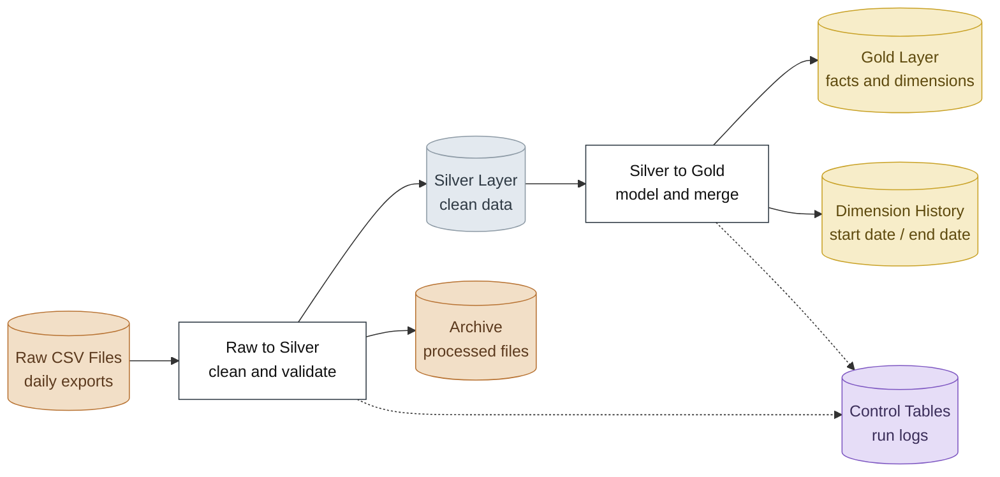
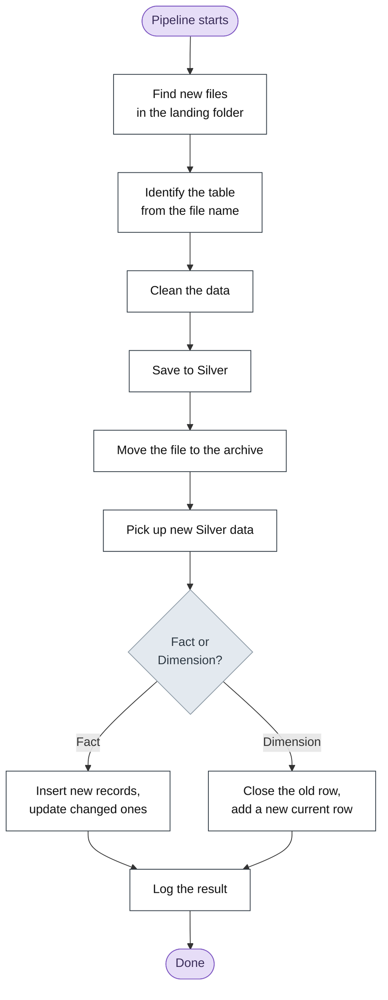
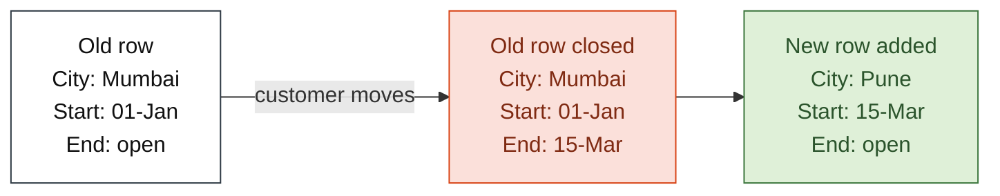
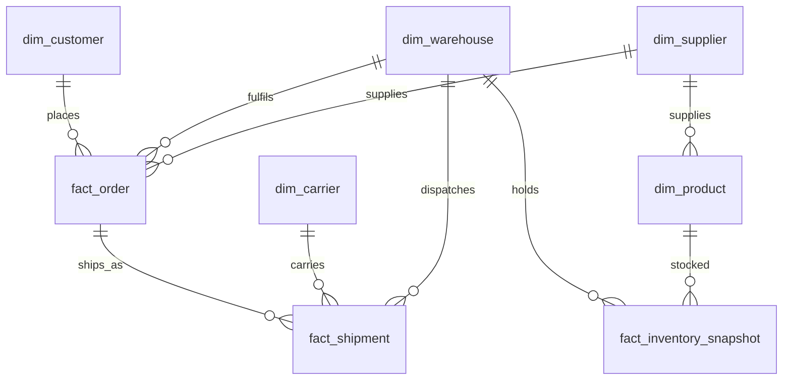

# Supply Chain Data Pipeline


An end-to-end data engineering project that takes daily supply chain files (orders, shipments, inventory, customers, products, suppliers, warehouses and carriers) and turns them into clean, report-ready tables on Databricks.

The project follows the **Medallion Architecture**: raw files go into a **Silver** layer, where they are cleaned, and then into a **Gold** layer, where they are organised for analysis. Along the way it keeps the **full history** of every dimension, so you can see what a customer, product or supplier looked like on any past date.

---

## What this project does

- **Collects** daily CSV files from a landing folder
- **Cleans** each file by fixing data types, removing duplicates and blank rows, and adding useful calculated fields
- **Stores** clean data in the Silver layer, organised by file date
- **Builds** a star schema in the Gold layer, made of fact tables and dimension tables
- **Keeps history** for dimensions: every change is saved as a new row with a start date and an end date
- **Tracks every run** in control tables, so you always know what was loaded, when, and whether it worked

---

## Architecture


```mermaid
flowchart LR
    A[("Raw CSV Files<br/>daily exports")] --> B["Raw to Silver<br/>clean and validate"]
    B --> C[("Silver Layer<br/>clean data")]
    C --> D["Silver to Gold<br/>model and merge"]
    D --> E[("Gold Layer<br/>facts and dimensions")]
    D --> H[("Dimension History<br/>start date / end date")]
    B --> F[("Archive<br/>processed files")]
    B -.-> G[("Control Tables<br/>run logs")]
    D -.-> G

    classDef raw fill:#F2DFC7,stroke:#B87333,color:#5C3A1E
    classDef slv fill:#E3E9EF,stroke:#8E9BA6,color:#2F3A44
    classDef gld fill:#F7EDC9,stroke:#C9A227,color:#5E4A0E
    classDef job fill:#FFFFFF,stroke:#2F3A44,color:#111111
    classDef ctl fill:#E6DDF7,stroke:#7E57C2,color:#3B2E5A

    class A,F raw
    class C slv
    class E,H gld
    class B,D job
    class G ctl
```

| Layer | What it holds |
|---|---|
| **Raw** | Original CSV files exactly as they arrive, for example `orders_20260918.csv` |
| **Silver** | Cleaned and validated data, one table per entity |
| **Gold** | Business-ready star schema of facts and dimensions, with history |
| **Control** | Logs of every pipeline run and every file processed |

---

## How it works


```mermaid
flowchart TD
    S(["Pipeline starts"]) --> F1["Find new files<br/>in the landing folder"]
    F1 --> F2["Identify the table<br/>from the file name"]
    F2 --> F3["Clean the data"]
    F3 --> F4["Save to Silver"]
    F4 --> F5["Move the file to the archive"]
    F5 --> G1["Pick up new Silver data"]
    G1 --> G2{"Fact or<br/>Dimension?"}
    G2 -->|Fact| G3["Insert new records,<br/>update changed ones"]
    G2 -->|Dimension| G4["Close the old row,<br/>add a new current row"]
    G3 --> L["Log the result"]
    G4 --> L
    L --> E(["Done"])

    classDef step fill:#FFFFFF,stroke:#2F3A44,color:#111111
    classDef dec fill:#E3E9EF,stroke:#8E9BA6,color:#2F3A44
    classDef term fill:#E6DDF7,stroke:#7E57C2,color:#3B2E5A
    class F1,F2,F3,F4,F5,G1,G3,G4,L step
    class G2 dec
    class S,E term
```

### Step 1: Raw to Silver
1. The pipeline looks for CSV files in the landing folder.
2. It reads the table name from the file name (`customers_20260918.csv` goes to **customers**).
3. Each file is cleaned: correct data types, no duplicates, no empty rows.
4. The clean data is saved to Silver, grouped by the file date.
5. The original file is moved to an archive folder so it is not loaded twice.

### Step 2: Silver to Gold
1. Only **new** data since the last successful run is picked up.
2. **Fact tables** (orders, shipments, inventory) receive new records, and existing records are updated if they changed.
3. **Dimension tables** (customers, products, suppliers, warehouses, carriers) keep their full history, as explained below.
4. Every table's result is recorded in the control table.

---

## Dimension History (Start Date and End Date)

Business details change over time. A customer moves city, a supplier gets a new rating, a product changes price. Instead of overwriting the old values, the pipeline **keeps every version**.

When a change arrives:
1. The old row is **closed** by setting its **end date**.
2. A **new row** is added with the new values and a fresh **start date**.
3. The newest row stays **open**, marking it as the current version.


```mermaid
flowchart LR
    A["Old row<br/>City: Mumbai<br/>Start: 01-Jan<br/>End: open"] -->|"customer moves"| B["Old row closed<br/>City: Mumbai<br/>Start: 01-Jan<br/>End: 15-Mar"]
    B --> C["New row added<br/>City: Pune<br/>Start: 15-Mar<br/>End: open"]

    classDef old fill:#FBE0DA,stroke:#D84315,color:#7F2A12
    classDef cur fill:#DFF0D8,stroke:#3C763D,color:#2B542C
    classDef was fill:#FFFFFF,stroke:#2F3A44,color:#111111
    class A was
    class B old
    class C cur
```

**Example: `dim_customer`**

| customer_id | customer_name | city | start_date | end_date |
|---|---|---|---|---|
| C101 | Rahul Shah | Mumbai | 2026-01-01 | 2026-03-15 |
| C101 | Rahul Shah | Pune | 2026-03-15 | *open (current)* |

This lets you answer questions like *"Which city was this customer in when they placed an order in February?"* while still seeing the latest details.

---

## Data Model (Gold Layer)

The Gold layer is a **star schema**: fact tables hold business events, and dimension tables describe who, what and where.


```mermaid
erDiagram
    dim_customer  ||--o{ fact_order : places
    dim_warehouse ||--o{ fact_order : fulfils
    dim_supplier  ||--o{ fact_order : supplies
    fact_order    ||--o{ fact_shipment : ships_as
    dim_carrier   ||--o{ fact_shipment : carries
    dim_warehouse ||--o{ fact_shipment : dispatches
    dim_warehouse ||--o{ fact_inventory_snapshot : holds
    dim_product   ||--o{ fact_inventory_snapshot : stocked
    dim_supplier  ||--o{ dim_product : supplies
```

| Table | Type | What it tells you |
|---|---|---|
| `fact_order` | Fact | Customer orders: value, quantity and status |
| `fact_shipment` | Fact | Deliveries: delays, delivered quantity, items lost in transit |
| `fact_inventory_snapshot` | Fact | Daily stock levels per product and warehouse |
| `dim_customer` | Dimension (with history) | Customer details, segment and tier |
| `dim_product` | Dimension (with history) | Product details, pricing and margin |
| `dim_supplier` | Dimension (with history) | Supplier details, rating and lead time |
| `dim_warehouse` | Dimension (with history) | Warehouse location and capacity |
| `dim_carrier` | Dimension (with history) | Carrier on-time and damage rates |

---

## Run Tracking

Every run is logged, so nothing is a guess.

| Control table | What it records |
|---|---|
| `pipeline_log` | One row per run: start time, end time, status and file counts |
| `files_log` | One row per file: whether it succeeded, failed or was skipped |
| `pipeline_control_gold` | Last loaded date per Gold table, so the next run loads only new data |

If a file fails, it is picked up again automatically on the next run.

---

## Load Modes

| Mode | What it does |
|---|---|
| **Incremental** | Loads only new files and retries failed ones. Used for daily runs. |
| **Full** | Reloads everything from scratch. Used for a rebuild. |

---

## Project Structure

```
Supply_chain/
├── config/
│   ├── config.py             # Raw to Silver settings and table routing
│   ├── config_gold.py        # Gold table definitions
│   └── pipeline_logger.py    # Run and file logging
└── Ingestion/
    ├── Raw_to_silver/
    │   └── Row_to_silver.py      # Raw to Silver pipeline
    ├── Silver_to_gold/
    │   └── silver_to_gold.py     # Silver to Gold pipeline (facts and history dims)
    └── transformations/
        ├── cleaning_raw_silver.py
        ├── cleaning_silver_gold.py
        ├── schema_raw_silver.py
        └── schema_silver_gold.py
```

---

## How to Run

1. Upload the project to your Databricks workspace.
2. Update the workspace paths in the config files to match your folder.
3. Drop CSV files named like `<table>_YYYYMMDD.csv` into the Raw volume.
4. Run **`Row_to_silver.py`**, then **`silver_to_gold.py`** (or schedule both as a Databricks Job).

---

## Tech Stack

- **Databricks**: platform and job scheduling
- **PySpark**: data processing
- **Delta Lake**: reliable tables with merge support
- **Unity Catalog Volumes**: file storage
